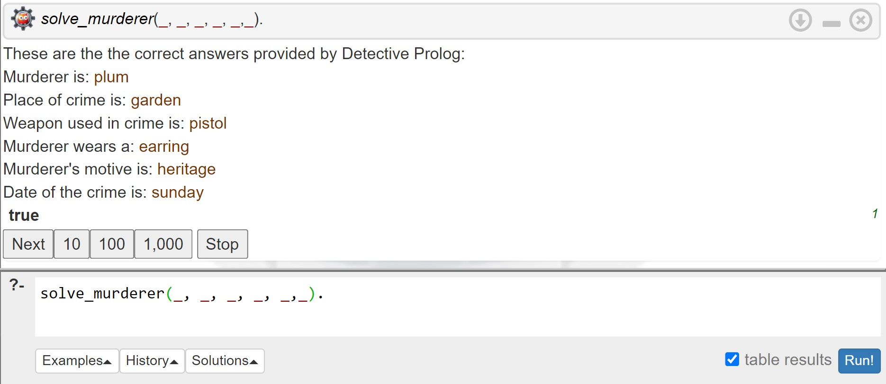

#### Group Members: Zahra Jaleh & Vahid Mousavinezhad

# DETECTIVE PROLOG

The goal of this project is to create an educational game based on logic programming. The idea is to find out who the murderer is using a list of facts, in the manner of a detective at a crime scene. We need to create a set of rules to gather evidence and assist users in tracking down the murderer.

We utilize Prolog to provide clues that aid in deducing which suspect is the murderer. Prolog employs logic-based deduction to systematically and efficiently eliminate suspects who do not fit the given clues until the correct answer is revealed.

Additionally, the game involves user interactions and employs Prolog to verify user inputs against actual scripts, determining the accuracy of their answers.

## PROJECT DESCRIPTION

A murder mystery game where the player, assumed to be a detective, tries to solve a murder by entering the murder weapon, location, day, motive, and suspect. The program uses a set of rules to determine which suspect committed the crime based on the entered information and check with the player’s guess. Clues and scenarios should be carefully chosen to ensure that they are relevant to the story and that they help the player to solve the murder.

**Suspects:**

Men:
- Mustard
- Green
- Plum
- Brunette

Women:
- Scarlett
- Peacock
- Peach
- Rihanna

**List of evidence:**

1. MURDER WEAPONS: Knife, Wrench, Rope, Pistol, Candlestick, Poison
2. LOCATIONS: Kitchen, Library, Dining room, Bedroom, Garage, Garden, Pool, Stable
3. WEEKDAYS: Friday, Saturday, Sunday
4. MOTIVES: Revenge, Heritage, Money, Passion, Hatred
5. HANDEDNESS: Left, Right
6. SMOKE: Pipe, Grass, Cigarette
7. HAIR COLOR: Black, Brown, Blonde

We perform Prolog programming in SWISH (SWI-Prolog for SHaring), a web-based integrated development environment (IDE) specifically designed for Prolog programming. SWISH offers a convenient platform for writing, testing, and sharing Prolog code through a web browser interface.


### What is Prolog?

Prolog is a logic programming language that operates based on a declarative approach, emphasizing the description of relationships and logical rules rather than explicit instructions. It allows users to define facts and rules and then query them to obtain logical deductions. Prolog programs consist of a knowledge base containing facts and rules, and queries are posed to the system to infer logical conclusions. It uses a form of automated reasoning called resolution to perform logical inference. Prolog's key strength lies in its ability to solve problems using logical and constraint-based methods


### How are facts defined in Prolog?

In Prolog, facts are simple statements that represent true information about something. They consist of a predicate and its arguments, describing a relationship or property. Facts serve as the fundamental pieces of knowledge in Prolog, forming the basis for logical deductions and reasoning in the program.

In our murder mystery game, we have provided Prolog with a set of facts about the suspects based on the list of evidence and the scenario. You can see some examples of them below:

```prolog
% Declare the men
man(snoop).
man(mustard).
man(green).
man(plum).
man(brunette).

% Declare the handedness of suspects
handedness(mustard, left).
handedness(green, left).
handedness(brunette, right).
handedness(scarlett, left).
handedness(peach, right).
handedness(peacock, left).
handedness(plum, left).
handedness(rihanna, right).

% Declare which suspect has which weapon
has_weapon(plum, pistol).
has_weapon(mustard, knife).
has_weapon(peach, rope).
has_weapon(scarlett, poison).
has_weapon(peacock, knife).
has_weapon(brunette, wrench).
has_weapon(green, candlestick).
has_weapon(rihanna, pistol).

```

### What is the rule in Prolog?

In Prolog, rules are used to define relationships between entities and to establish logical connections. They consist of a head and a body, separated by the "**:-**" operator. The head represents the goal or the conclusion, while the body contains the conditions or the premises that need to be satisfied for the rule to be true. Rules can also have multiple conditions in the body, connected by commas ("**,**") to express logical conjunction.

In order to uncover the identity of a murderer, we analyze each crime scenario and develop additional rules that enable Prolog to deduce the murderer. However, before diving into these rules, let's discuss an essential Prolog operator called the negation opernad (**\\+**).


### What is "\\+" operand?

Prolog employs a backward-chaining algorithm to explore its knowledge base, which consists of facts and rules, in order to find answers to queries. The negation operator (**\\+**) plays a significant role in Prolog as it allows for non-monotonic reasoning. This means that Prolog can draw conclusions that may be contradicted or invalidated by new information.

The negation operator enables Prolog to reason with incomplete or uncertain data, which greatly enhances its problem-solving capabilities. By utilizing negation, Prolog becomes a powerful tool for tackling puzzles and resolving complex mysteries, such as identifying the perpetrator of a crime.


```prolog
% Declare the suspects
suspect(X):- man(X); woman(X), \+ victim(X).
```

It means the suspect could be a man or(;) a woman who is not the victim.In the following, we you can see various clues and their corresponding rules. Each clue pertains to a specific element of the murder mystery, such as the motive, the weapon,...


**Clue1:**
"Police found victim's body on Saturday morning and doctor declare the crime happened about 12 hours ago."
```prolog
% Declare the date of crime
date(X) :- day(X), \+ X = saturday, \+ X = sunday.
```

**Clue2:**
"The police have found a black hair under the victim's fingernail, which belongs to the murderer. Additionally, they have also found a piece of jewelry in the victim's fist that does not belong to him. Can you guess the jewelry?"
```prolog
% Declare the new list of the suspect based on the fact that suspect was black and has a jewelry
has_jewelry(X, Y, Z) :- suspect(X), hair_color(X, Y), jewelry(X, Z), \+ Y = blonde, \+ Y = brown.
```

**Clue3:**
"Mr. Snoop's body was found by his maid. Considering that the maid only has access to the outdoor area, can you guess the location of the murder?"
```prolog
% Declare the victim found outside the house
crime_place(X, S) :- suspect(X), kills_in(X, S), \+ S = kitchen, \+ S = bedroom, \+ S = library.
```


### How does Prolog solve the mystery?
Using the defined rules for each scenario, we can use Prolog to deduce the identity of the murderer. By writing a predicate and querying it, Prolog will provide us with the exact evidence related to the crime and reveal the identity of murderer. Let's look at an example in SWISH:

```prolog
% Solve the murder mystery
solve_murderer(X, Y, Z, O, P, Q):- 
    crime_place(X, Y), crime_weapon(X, Z, _), has_jewelry(X, _, Q), motive_crime(X, O), date(X, _, P), 
    write("These are the the correct answers provided by Detective Prolog:"),nl,
    write("Murderer is: "), write(X), nl,
    write("Place of crime is: "), write(Y), nl,
    write("Weapon used in crime is: "), write(Z), nl,
    write("Murderer wears a: "), write(Q), nl,
    write("Murderer's motive is: "), write(O), nl,
    write("Date of the crime is: "), write(P), nl.
```

<div style="align-items:center">
        <figure>
            
            <figcaption>Fig1. Swish UI and the Prolog deductions. </figcaption>
        </figure>
</div>


### How does the game interact with the player?

As mentioned earlier, our game incorporates user interactions and utilizes Prolog to validate user inputs by comparing them against actual scripts to assess the accuracy of their answers. Figure 2 provides a visual representation of the mechanism employed in our game. At the beginning of the game, we present all the facts to the player. Then, the player carefully examines the given clues, such as the location and day of the crime, and makes corresponding guesses. We have established a maximum score of 100, and for each incorrect answer, 5 points are deducted. If the player fails to answer all the questions correctly, they have the opportunity to try again. However, if the player's score falls below 0 due to incorrect answers, it's game over. On the other hand, if the player successfully answers all the questions, they can proceed to make their final guess, which involves identifying the killer's identity. In the end, the player will be able to view their final score along with the correct answers provided by Prolog.

<div style="align-items:center">
        <figure>
            
            <figcaption>Fig2. The interactive mechanism of the Detective Prolog game with the player. </figcaption>
        </figure>
</div>


### Loop in Prolog using "repeat" operand

As you can observe, we need a loop in which players can refine their answers. In Prolog, the **repeat** predicate is used to create an infinite loop. It will repeatedly backtrack and re-evaluate the goals specified after it. The **repeat** predicate has no arguments and always succeeds, allowing you to create a loop that continues indefinitely until a specific condition is met or until the program is interrupted. We defined a dynamic variable for the initial score, which deducts 5 points for every incorrect guess. Additionally, we defined another dynamic variable that exits the loop and reaches the last guess, which is the name of the killer, in case all the questions are answered correctly. The loop is terminated using the "**!**" cut operator, which prevents backtracking and ensures the loop exits. Otherwise, the loop continues by backtracking to the repeat predicate, prompting for input again.

```prolog
:- dynamic u/1. initialize_u :- retractall(u(_)), assert(u(0)). 
:- dynamic p/1. initialize_p :- retractall(p(_)), assert(p(100)).

check(H, I, J, K, L) :- H \= garden, I \= heritage, J \= pistol, K \= earring, L \= sunday, write('Correct answers = 0'),nl, 
    write('Hint! Place is garden!'),nl, write('Try again and refine your answers'),
    retract(p(OldValue)), NewValue is OldValue - 25, assert(p(NewValue)),nl, nl.

% check predicate for all the other conditions
...

check(H, I, J, K, L) :- H = garden, I = heritage, J = pistol, K = earring, L = sunday, 
    write('Congratulations!! You answered all the questions correctly.'),nl,
    retract(u(OldValue)), NewValue is OldValue + 1, assert(u(NewValue)), nl,nl.

initialize_p,
    repeat,
      initialize_u,
      % Get the inputs A, B, C, D, E
      ...
      check(A, B, C, D, E),
      u(U),
      p(P),
      write('Your point = '), write(P), nl, nl,
 	  (P =< 0, write(" >>>  Game over!  <<< "),nl ; U > 0), !,
```

### Detective Prolog Game

You can find the playable and final version codes of Detective Prolog in the [**game**](https://gitlab.unige.ch/Seyedvahid.Mousavinezhad/inspector-prolog/-/tree/main/game) directory. The game is designed with three levels of difficulty, and their differences in difficulty are as follows:

**Level 1:**
- The player needs to correctly guess 4 clues to have the final guess for the murderer's identity.
- Based on the answers, the player receives hints indicating which answers are correct.

**Level 2:**
- The player needs to correctly guess 5 clues to have the final guess for the murderer's identity.
- Based on the answers, the player receives hints indicating which answers are correct.

**Level 3:**
- The player needs to correctly guess 5 clues to have the final guess for the murderer's identity.
- Based on the answers, the player receives hints indicating which answer is correct and which one is wrong. For instance, if the player has two correct answers, they will be informed about one answer being correct and one answer being wrong.

The game is also designed in two versions. The difference between these two versions lies in the hints section. In one of the versions, which is named "rules," the player can view the Prolog code written for that particular evidence. This aspect increases the educational aspect of the game.

We hope you enjoy playing the game and that we have been able to introduce useful aspects of Prolog programming to you.

## Resources
- ["The power of Prolog" by Markus Triska](https://www.metalevel.at/prolog)
- ["Learn Prolog Now!" by Patrick Blackburn, Johan Bos, and Kristina Striegnitz](https://doc.lagout.org/programmation/Prolog/Learn%20Prolog%20Now%21%20-%20Patrick%20Blackburn%2C%20Johan%20Bos%20%2C%20Kristina%20Striegnitz.pdf)
